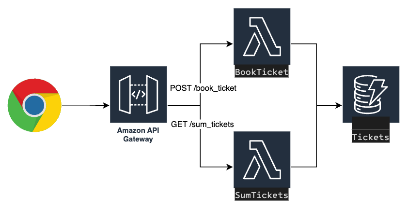

# App Description
This SAM application consists of a simple ticket booking system, "Crisis at the Concert". The application is designed to allow users to book tickets for a concert. Let's break it down:

## High Level Design


## SAM Template
The SAM template, defined in YAML format, describes the AWS resources that make up the application.
```yaml linenums="1"
AWSTemplateFormatVersion: '2010-09-09'
Transform: AWS::Serverless-2016-10-31
Description: Crisis at the Concert Ticket Booking System

Resources:
  BookTicketFunction:
    Type: AWS::Serverless::Function 
    Properties:
      Handler: ticket_booking.handler
      Runtime: python3.10
      Environment:
        Variables:
          TABLE_NAME: !Ref TicketsTable
      Events:
        BookTicketApi:
          Type: Api 
          Properties:
            Path: /book_ticket
            Method: post

  SumTicketsFunction:
    Type: AWS::Serverless::Function 
    Properties:
      Handler: sum_tickets.handler
      Runtime: python3.10
      Environment:
        Variables:
          TABLE_NAME: !Ref TicketsTable
      Events:
        SumTicketsApi:
          Type: Api 
          Properties:
            Path: /sum_tickets
            Method: get

  TicketsTable:
    Type: AWS::Serverless::SimpleTable
```

The Resources section of the template describes three resources:

1. **BookTicketFunction**: This is a Lambda function that handles the ticket booking logic. It's written in Python, and the function handler is ticket_booking.handler. The function is triggered by an API Gateway event (BookTicketApi) when a POST request is made to the /book_ticket path. The environment variable TABLE_NAME is set to the logical ID of the DynamoDB table resource (TicketsTable), which will be replaced by the actual table name at runtime.

2. **SumTicketsFunction**: This is a Lambda function that summarizes the number of booked tickets.

3. **TicketsTable**: This is a DynamoDB table where ticket booking records will be stored. The table is created with default properties defined by `AWS::Serverless::SimpleTable`.

## Book Function Code
The Lambda function, `ticket_booking.handler`, is written in Python. It receives an event object from API Gateway, which contains details of the HTTP request.

The function begins by parsing the body of the HTTP request, expecting to find 'ticket_count' field. If these fields are not present, it returns a 400 status code indicating a bad request.
```py linenums="1"
    body = json.loads(event['body'])
    if 'ticket_count' not in body:
        return {
            'statusCode': 400,
            'body': json.dumps({'message': 'Invalid request, name and ticket_count are required.'})
        }
```

The function also checks that the 'ticket_count' field is a string, returning a 400 status code if not.
```py linenums="1"
    if type(ticket_count) is not str:
        return {
            'statusCode': 400,
            'body': json.dumps({'message': 'Invalid request, ticket_count should be a number.'})
        }
```

```py linenums="1"
dynamodb = boto3.resource('dynamodb')
table = dynamodb.Table(os.getenv('TABLE_NAME'))
```
The function establishes a connection to DynamoDB and references the table specified by the `TABLE_NAME` environment variable.

If the request is valid, the function attempts to store the booking information in the DynamoDB table. If this operation fails for any reason, it returns a 500 status code indicating an internal server error.
```py linenums="1"
    try:
        table.put_item(
            Item={
                'id': _generate_random_string(5),
                'name': name,
                'ticket_count': ticket_count
            }
        )
    except Exception as e:
        return {
            'statusCode': 500,
            'body': json.dumps({'message': 'Internal server error.'})
        }
```
If the operation is successful, the function returns a 200 status code and a message indicating that the booking was successful.
```py linenums="1"
    return {
        'statusCode': 200,
        'body': json.dumps({'message': f'Successfully booked {ticket_count} tickets for {name}.'})
    }
```
In summary, this is a simple serverless ticket booking system, where a user can book tickets by making a POST request to the `/book_ticket` API endpoint with their name and the number of tickets they want to book. The system will validate the request, book the tickets by adding a record to a DynamoDB table, and return a success message. If anything goes wrong during this process, an appropriate HTTP status code and error message will be returned.

## Sum Function Code
```py linenums="1"
try:
        response = table.scan()
    except Exception as e:
        return {
            'statusCode': 500,
            'body': json.dumps({'message': 'Internal server error.'})
        }

    ticket_sum = sum(int(item['ticket_count']) for item in response['Items'])
```
The try block contains a scan operation that retrieves all the items from the TicketsTable. If the scan operation fails for any reason (like the table doesn't exist or there's a problem with permissions), an exception is raised, and the function returns a 500 Internal Server Error response.